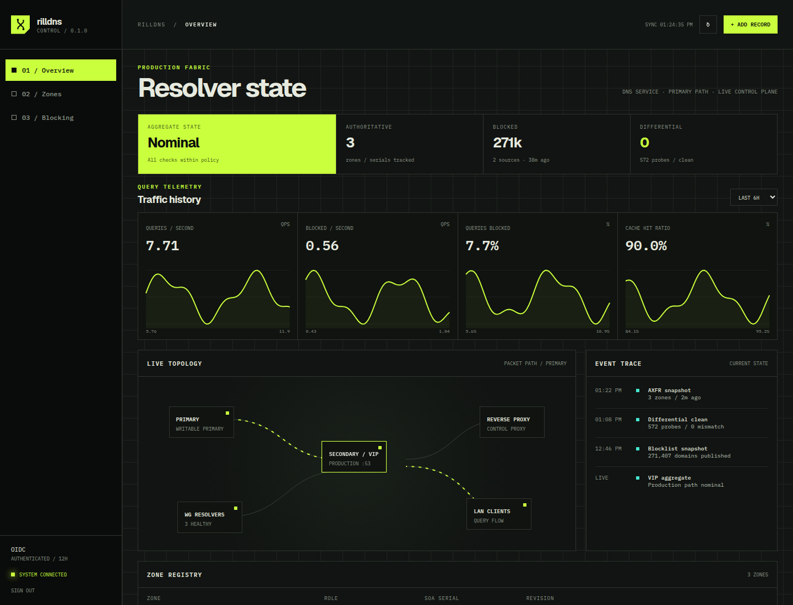
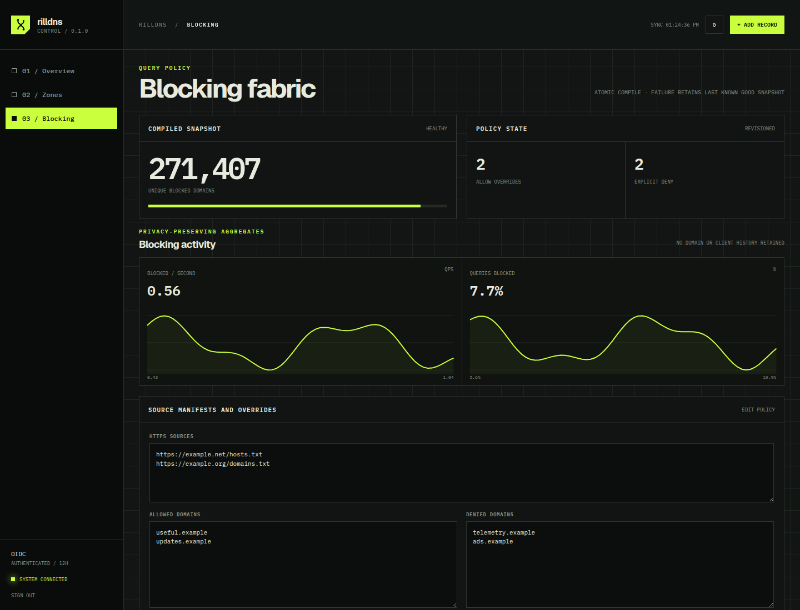

# RillDNS

[](https://github.com/kilo666mj/rilldns/actions/workflows/ci.yml)
[](LICENSE)

RillDNS is a compact DNS operations stack built around CoreDNS. It combines
authoritative zone management, forwarding and caching, authenticated
primary/secondary replication, managed ad blocking, a Go API and MCP server,
an OIDC-protected web console, differential checks, and Prometheus monitoring.

For a first server deployment, use the sanitized, variable-driven
[Ansible playbook](ansible/README.md). It keeps real inventories, zones, and
secrets outside the public repository and validates required settings before
changing either node.

It is intended for experienced self-hosters and small infrastructure teams.
RillDNS is not a hosted service or a turnkey replacement for understanding DNS,
firewalling, backups, and key management.



## Highlights

- Atomic, revisioned zone and RRset changes with dry-run plans and audit logs
- TSIG-authenticated NOTIFY and AXFR replication with last-known-good snapshots
- UDP/TCP differential probes across authoritative records and edge cases
- Daily compiled hosts/domain blocking with allow and deny overrides
- Privacy-preserving blocked-query rates and percentages—no query or client
  history is retained
- REST management API and SSH-stdio MCP tools
- OIDC Authorization Code + PKCE web console
- Health, readiness, CoreDNS, refresh, replication, and differential metrics



## Try it locally

Requirements: Docker with Compose, Go 1.26 or later, `dig`, and `curl`.

```sh
make test
make up
make smoke
```

The local Compose fixture listens on `127.0.0.1:1053` and uses only reserved
example names and addresses:

```sh
dig @127.0.0.1 -p 1053 www.example.test A
dig @127.0.0.1 -p 1053 ads.example.test A
dig @127.0.0.1 -p 1053 example.com A
curl http://127.0.0.1:9153/metrics
```

Stop it with `make down`.

## Architecture

The reference production model uses two native CoreDNS nodes:

```text
                         HTTPS / OIDC
                              │
                       reverse proxy
                              │
                primary API ─── backup ─── secondary API
                 writable                    read-only
                      │    TSIG NOTIFY/AXFR      │
                      └──────────┬───────────────┘
LAN clients ──────────────── DNS VIP ───────────── upstream resolvers
                                  │
                           Prometheus metrics
```

See [production deployment](docs/deployment.md), the
[API reference](docs/api.md), [high availability](docs/ha.md),
[MCP setup](docs/mcp.md), and
[web UI configuration](docs/ui.md). Files under `deploy/` are sanitized
examples and must be adapted to your addresses, zones, firewall, and identity
provider.

## Repository layout

```text
cmd/                       Go commands and services
internal/api/              REST API and Prometheus history queries
internal/webui/            embedded OIDC-protected console
internal/zones/            validated atomic zone store
internal/secondary/        persistent authenticated replication
internal/querytelemetry/   aggregate-only dnstap collector
config/                    local Compose CoreDNS configuration
data/                      local fixtures and blocklist policy
deploy/                    example systemd, nginx, and Prometheus files
docs/                      operations and API documentation
```

## Security and privacy

Secrets are read from root-owned files or environment variables and must never
be committed. The query telemetry collector compares each name against the
in-memory block set, increments aggregate counters, and immediately discards
the name and client address. See [SECURITY.md](SECURITY.md) for reporting and
the current security model.

## Status

RillDNS is operational software extracted from a real deployment, but its
public interfaces may still change. Native DNSSEC key management and signing
are not implemented; do not use it for zones that require RillDNS to maintain a
DNSSEC trust chain.

## Contributing

Bug reports and focused pull requests are welcome. Read
[CONTRIBUTING.md](CONTRIBUTING.md) before submitting changes.

## License

RillDNS is available under the [MIT License](LICENSE).
